<div align="center">

# 🔥 EXERCISE PRO
### เว็บแอปพลิเคชันจัดการและนำทางการออกกำลังกายส่วนตัว
**สูตรลดไขมันติดสปีด (Fat Loss Acceleration) • ดัมเบล + HIIT 25–30 นาที • เดินรับลม สวนเกษตร มข.**

[](https://Thagoose3.github.io/Exercise/)
[](PATCHNOTE.md)
[](https://firebase.google.com/)
[](LICENSE)
[](https://Thagoose3.github.io/Exercise/)

<br>

<p align="center">
  <a href="#-ตารางออกกำลังกายใน-1-สัปดาห์">ตารางรายสัปดาห์</a> •
  <a href="#-ฟีเจอร์เด่น">ฟีเจอร์หลัก</a> •
  <a href="#-ภาพรวมโปรแกรมแต่ละวัน">รายละเอียดโปรแกรม</a> •
  <a href="#-วิธีเปิดใช้งานและติดตั้งบนมือถือ">การติดตั้งบนมือถือ</a> •
  <a href="PATCHNOTE.md">บันทึกการอัปเดต (Patch Note)</a>
</p>

---

</div>

## 📖 เกี่ยวกับโปรเจกต์ (Overview)

**Exercise Pro** คือเว็บแอปพลิเคชันออกกำลังกายส่วนตัวที่ถูกออกแบบมาเพื่อความกระชับ ตรงจุด และเห็นผลลัพธ์การลดไขมันเร็วที่สุด โดยเน้นการเวทเทรนนิ่งด้วยดัมเบล 15 นาทีเพื่อสร้างเตาเผาไขมัน (Muscle Mass) ผสานกับ Low-Impact HIIT 8–10 นาทีเพื่อกระตุ้น Afterburn Effect ตลอดวัน พร้อมโหมดเดินรับลมธรรมชาติ Zone 2 Cardio ที่ **สวนเกษตร มหาวิทยาลัยขอนแก่น (มข.)**

แอปทำงานแบบ **Client-Side 100%** บันทึกข้อมูลลงเครื่องของคุณ (LocalStorage) ไม่ต้องล็อกอิน ปลอดภัย ไร้โฆษณา และรองรับการเปิดใช้งานบนมือถือทุกรุ่น

---

## 🎯 ตารางออกกำลังกายใน 1 สัปดาห์ (Weekly Schedule)

```mermaid
gantt
    title ตารางออกกำลังกายประจำสัปดาห์ (Weekly Rhythm)
    dateFormat  X
    axisFormat %d
    section ในห้อง (25-30m)
    จันทร์ : Upper Body + Core HIIT      :active, 1, 2
    พุธ   : Lower Body + Cardio HIIT     :active, 3, 4
    ศุกร์ : DB Complex + Tabata Finisher :active, 5, 6
    section รับลมข้างนอก
    พฤหัสบดี : เดินสวนเกษตร มข. (45m)    :crit, 4, 5
    เสาร์    : เดินสวนเกษตร มข. / พัก    :crit, 6, 7
    section พักผ่อน
    อังคาร   : Rest & Muscle Recovery    :done, 2, 3
    อาทิตย์ : Sunday Recharge & Prep    :done, 7, 8
```



| วัน | โปรแกรมการฝึก | มัดกล้ามเนื้อเป้าหมาย | รูปแบบ & ระยะเวลา |
| :--- | :--- | :--- | :---: |
| **🟢 จันทร์** | **Upper Body & Core Strength + Core-HIIT** | อก, ไหล่, หลังแขน + หน้าท้อง & เอวเอส | 25–30 นาที |
| **🛌 อังคาร** | **Rest Day & Muscle Recovery** | ซ่อมแซมเส้นใยกล้ามเนื้อ + ดื่มน้ำ 2.5L | พักผ่อนเต็มที่ |
| **🟢 พุธ** | **Lower Body & Glutes + Cardio-HIIT Burnout** | เตาเผาต้นขา, ก้นเด้ง + สับคาร์ดิโอไร้แรงกระแทก | 25–30 นาที |
| **🌳 พฤหัสฯ** | **Outdoor Walk & Nature Therapy** | เดินรับลมสบายๆ @ **สวนเกษตร มข.** (Zone 2) | 40–50 นาที |
| **🟢 ศุกร์** | **Full Body Complex + Tabata Finisher** | ฟูลบอดี้ เบิร์นทั่วร่าง หัวใจสูบฉีด | 25–30 นาที |
| **🍃 เสาร์** | **Outdoor Walk / Weekend Recovery** | เดินรับลมยามเย็น สวนเกษตร มข. หรือพักผ่อน | 40–50 นาที (หรือพัก) |
| **☕ อาทิตย์** | **Sunday Recharge & Prep** | ชาร์จพลัง ชมนกชมไม้ เตรียมพร้อมลุยสัปดาห์ใหม่ | พักผ่อนเต็มที่ |

---

## ⚡ ฟีเจอร์เด่น (Key Features)

### 1. 🏋️ ระบบนำทางการออกกำลังกายประจำวัน (Smart Today Dashboard)
* **Auto-Detect Day:** ระบบตรวจจับวันในสัปดาห์อัตโนมัติ เปิดเว็บปุ๊บเจอโปรแกรมของวันนั้นทันที พร้อมปุ่มสลับเลือกดูวันอื่นๆ ได้อิสระ
* **Interactive Set Tracker:** ติ๊กถูกเมื่อเล่นจบแต่ละเซต (เซต 1, 2, 3) 
* **Auto Rest Timer:** เมื่อติ๊กจบเซต ตัวจับเวลาพักเซต (30s, 45s, 60s, 90s) จะเปิดขึ้นมาให้อัตโนมัติพร้อมเสียง Beep เตือนเมื่อครบเวลา

### 2. ⏱️ เครื่องยนต์จับเวลา HIIT / Tabata อัตโนมัติ (Fullscreen HIIT Engine)
* **High-Contrast Screen:** หน้าจอจับเวลาขนาดใหญ่ เปลี่ยนสีตามสถานะอย่างชัดเจน
  * 🔵 **น้ำเงิน (Prepare):** ช่วงเตรียมตัว 10 วินาที
  * 🟢 **เขียว (Work):** ช่วงใส่เต็มสปีด 30–40 วินาที
  * 🟠 **ส้ม (Rest):** ช่วงพักหายใจ 15–20 วินาที
* **Next Up Preview:** แสดงชื่อท่าถัดไปให้คุณเตรียมตัวล่วงหน้า
* **Web Audio & Thai Speech:** เสียง Beep นับถอยหลัง 3-2-1 และเสียงพูดบรรยายชื่อท่าภาษาไทย
* **Screen Wake Lock API:** ล็อคหน้าจอมือถือให้สว่างตลอดการออกกำลังกาย ไม่ดับเอง

### 3. 🌳 โหมดเดินรับลม สวนเกษตร มข. (Outdoor Walk Tracker)
* นาฬิกาจับเวลานับเป้าหมาย 45 นาทีสำหรับการเดิน Zone 2
* มีระบบเสียงเตือนทุกๆ 10 นาที (Milestone Beeps & Speech) เพื่อให้คุณรู้เวลาโดยไม่ต้องหยิบมือถือขึ้นมาดูบ่อยๆ
* ประเมินจำนวนแคลอรี่ที่เผาผลาญแบบ Real-Time

### 4. 📊 ระบบบันทึกสถิติและความต่อเนื่อง (Streak & LocalStorage History)
* บันทึกประวัติการออกกำลังกาย จำนวนครั้ง เวลาสะสม และแคลอรี่ลงในเครื่องของคุณ (LocalStorage)
* นับสถิติความต่อเนื่อง (Streak 🔥) เพื่อสร้างวินัยและกำลังใจ
* ข้อมูลทั้งหมดเป็นส่วนตัว 100% ไม่ส่งออกนอกเครื่อง

---

## 📋 รายละเอียดโปรแกรมแต่ละวัน (Workout Routines)

<details>
<summary><b>🟢 วันจันทร์: Upper Body & Core Strength + Core-HIIT (คลิกเพื่อดูท่าฝึก)</b></summary>

<br>

#### ช่วงที่ 1: ดัมเบลช่วงบน (15 นาที) — พัก 45 วินาทีระหว่างเซต
1. **Floor Dumbbell Chest Press:** 3 เซต x 10–12 ครั้ง *(เน้นอกและหลังแขน นอนบนเสื่อปลอดภัยต่อไหล่)*
2. **Dumbbell Overhead Press:** 3 เซต x 10–12 ครั้ง *(เน้นหัวไหล่กลมสวยและแขนกระชับ)*
3. **Incline Push-ups:** 3 เซต x 8–12 ครั้ง *(วิดพื้นกับขอบโต๊ะหรือผนัง ปรับระดับความชันได้)*

#### ช่วงที่ 2: Core & Metabolic HIIT (8–10 นาที) — ทำ 40 วิ / พัก 20 วิ (3 รอบ)
1. **Standing Cross Elbow-to-Knee:** ยืนยกเข่าบิดแตะศอกตรงข้าม รีดหน้าท้องด้านข้าง
2. **Seated / Floor Russian Twists:** นั่งบิดลำตัวซ้าย-ขวา รีดเอวเอส
3. **Plank Hold:** แพลงก์ค้าง เกร็งหน้าท้องสร้างแกนกลางเหล็ก 40 วินาที

</details>

<details>
<summary><b>🟢 วันพุธ: Lower Body & Glutes + Cardio-HIIT Burnout (คลิกเพื่อดูท่าฝึก)</b></summary>

<br>

#### ช่วงที่ 1: ดัมเบลสร้างเตาเผา (15 นาที) — พัก 30–45 วินาทีระหว่างเซต
1. **Dumbbell Goblet Squats:** 3 เซต x 10–12 ครั้ง *(นั่งแตะเก้าอี้ โฟกัสต้นขาและก้น)*
2. **Dumbbell Romanian Deadlift (RDL):** 3 เซต x 10–12 ครั้ง *(พับสะโพก เน้นหลังขาและยกก้น)*
3. **Dumbbell Glute Bridge:** 3 เซต x 12–15 ครั้ง *(สะพานยกสะโพกวางดัมเบล ขมิบก้นแน่นๆ)*

#### ช่วงที่ 2: Low-Impact HIIT สับไขมัน (8–10 นาที) — ทำ 40 วิ / พัก 20 วิ (3 รอบ)
1. **Standing High Knees (Low-Impact):** เดินย่ำยกเข่าสูงติดสปีด ไม่กระโดด ไร้แรงกระแทก
2. **Shadow Boxing:** ยืนทรงมวย ปล่อยหมัดชกลมรัวเร็วต่อเนื่อง
3. **Step Jacks:** ก้าวเท้าแตะออกข้างพร้อมวาดแขนขึ้นสุด เซฟข้อเข่า

</details>

<details>
<summary><b>🟢 วันศุกร์: Full Body Dumbbell Complex + Tabata Finisher (คลิกเพื่อดูท่าฝึก)</b></summary>

<br>

#### ช่วงที่ 1: Dumbbell Complex (15 นาที) — ทำ 3 ท่าต่อเนื่องนับเป็น 1 เซต (พัก 60–90 วิ ทำ 3–4 เซต)
1. **Dumbbell Bent-over Row:** 10 ครั้ง *(ดึงดัมเบลพับตัว เน้นหลังหนาและกระชับสะบัก)*
2. **Dumbbell Push Press:** 10 ครั้ง *(ย่อส่งแรงดันดัมเบลขึ้นเหนือศีรษะ)*
3. **Dumbbell Reverse Lunges:** ข้างละ 8 ครั้ง *(ก้าวถอยหลังย่อเข่า เซฟสะบ้าหัวเข่า)*

#### ช่วงที่ 2: Tabata Finisher (6–8 นาที) — ทำ 30 วิ / พัก 15 วิ (3 รอบ)
1. **Wall Sit:** พิงกำแพงเกร็งต้นขาค้างไว้ เผาผลาญขาเหล็ก
2. **Fast Punches with Dumbbells:** ถือดัมเบลเบาๆ ชกลมรัวสปีด
3. **Standing Mountain Climbers:** ยืนยกเข่าแตะฝ่ามือสลับสปีดเร็ว

</details>

---

## ☁️ วิธีเชื่อมต่อ Google Login & Firebase Cloud Database (3 นาที)

หากคุณต้องการซิงค์ประวัติและสถิติข้ามอุปกรณ์ (มือถือ ↔ คอมพิวเตอร์):

1. **สร้าง Firebase Project:**
   - เข้าไปที่ [Firebase Console](https://console.firebase.google.com/) แล้วกด **"Add project"** (ตั้งชื่อโปรเจกต์ เช่น `my-exercise-app`)
2. **เปิดระบบ Google Sign-In:**
   - ไปที่เมนู **Build** ➡️ **Authentication** ➡️ กด **Get Started**
   - ในแท็บ **Sign-in method** เลือก **Google** แล้วกดเปิด **Enable** (เลือกอีเมล Support แล้วกด Save)
   - ในแท็บ **Settings** ของ Authentication ➡️ เลื่อนลงมาที่ **Authorized domains** ➡️ กด **Add domain** แล้วใส่ `thagoose3.github.io` และ `localhost`
3. **เปิดฐานข้อมูล Cloud Firestore:**
   - ไปที่เมนู **Build** ➡️ **Firestore Database** ➡️ กด **Create database**
   - เลือก **Start in test mode** (หรือ Production) แล้วกด **Next** ➡️ **Enable**
4. **นำคีย์มาใส่ในเว็บแอป:**
   - ไปที่ **Project Settings (รูปเฟืองมุมบนซ้าย)** ➡️ เลื่อนลงมาที่หัวข้อ **Your apps** ➡️ กดไอคอน **Web (</>)**
   - คัดลอกค่า `apiKey`, `projectId`, `appId` มาใส่ในเมนู **"ตั้งค่า Firebase Keys"** บนหน้าเว็บแอป (หรือแก้ไขในไฟล์ `js/firebaseConfig.js`)
   - กดปุ่ม **"เข้าสู่ระบบด้วย Google"** เพื่อเริ่มซิงค์ข้อมูลได้ทันที!

---

## 📱 วิธีเปิดใช้งานและติดตั้งบนมือถือ (PWA / Add to Home Screen)

คุณสามารถเปิดใช้งานเว็บแอปนี้บนมือถือ และบันทึกเป็นไอคอนแอปบนหน้าจอหลักได้เหมือนแอปทั่วไป:

```
[ เปิดเบราว์เซอร์บนมือถือ ] ➡️ [ ไปที่ลิงก์ GitHub Pages ] ➡️ [ กดแชร์ / เมนู 3 จุด ] ➡️ [ เลือก "เพิ่มไปยังหน้าจอโฮม" ]
```

* **สำหรับ iPhone (Safari):**
  1. เปิด [https://Thagoose3.github.io/Exercise/](https://Thagoose3.github.io/Exercise/)
  2. กดปุ่ม **Share (ไอคอนสี่เหลี่ยมลูกศรชี้ขึ้น)** ที่แถบด้านล่าง
  3. เลือก **"Add to Home Screen (เพิ่มไปยังหน้าจอโฮม)"**
* **สำหรับ Android (Chrome):**
  1. เปิด [https://Thagoose3.github.io/Exercise/](https://Thagoose3.github.io/Exercise/)
  2. กดปุ่ม **Menu (จุดสามจุดมุมบนขวา)**
  3. เลือก **"Install app (ติดตั้งแอป)"** หรือ **"Add to Home screen (เพิ่มลงในหน้าจอหลัก)"**

---

## 🛠️ สถาปัตยกรรมและเทคโนโลยี (Tech Stack)

* **UI Framework:** HTML5, Modern CSS3, [Tailwind CSS CDN](https://tailwindcss.com/)
* **Typography:** Google Fonts (`Kanit` & `Prompt`)
* **Icons:** [Lucide Icons](https://lucide.dev/)
* **Audio Engine:** Native Web Audio API (Synthesizer Oscillators - Zero MP3 latency) & Web Speech Synthesis API (Thai TTS)
* **Screen Management:** Screen Wake Lock API
* **Data Storage:** LocalStorage Engine with JSON serialization
* **Version Control & Hosting:** Git & [GitHub Pages](https://pages.github.com/)

---

## 📁 โครงสร้างโปรเจกต์ (Project Structure)

```
Exercise/
├── index.html          # หน้าหลัก Responsive Single-Page Application (PWA Ready)
├── manifest.json       # PWA Web App Manifest (ติดตั้งบนหน้าจอมือถือ)
├── assets/
│   ├── icons/          # ไอคอนแอปพลิเคชัน (favicon, 192px, 512px, apple-touch-icon)
│   └── promptpay-qr.png# QR Code สนับสนุนผู้พัฒนา
├── css/
│   └── style.css       # สไตล์ Dark Minimalist, Glassmorphism, Animations
├── js/
│   ├── app.js          # Main App Controller, UI Events, Tab Router
│   ├── workoutData.js  # ข้อมูลตาราง 7 วัน รายละเอียดท่า และเทคนิคการฝึก
│   ├── timer.js        # Web Audio Engine, Rest Timer, HIIT Engine, Walk Stopwatch
│   ├── storage.js      # Storage Manager (Cloud Firestore + LocalStorage)
│   ├── authManager.js  # Google Authentication Manager
│   └── firebaseConfig.js# Firebase App & Firestore Initializer
├── PATCHNOTE.md        # บันทึกประวัติการอัปเดตเวอร์ชัน
└── README.md           # เอกสารคู่มือการใช้งาน
```

---

## ☕ สนับสนุนผู้พัฒนา (Buy Me a Coffee)

หากคุณชื่นชอบและเห็นว่า **Exercise Pro** มีประโยชน์ต่อการออกกำลังกาย สุขภาพ และวินัยในการดูแลตัวเองของคุณ สามารถร่วมสนับสนุนค่ากาแฟและเป็นกำลังใจในการพัฒนาฟีเจอร์ใหม่ๆ ได้ที่ QR Code ด้านล่างนี้เลยครับ 💖

<div align="center">


<br/>

**พร้อมเพย์ (PromptPay) : นายฐากูร เอ็นสาร**

</div>

---

<div align="center">

**Exercise Pro** — Built with 💖 for your healthy lifestyle & fitness journey.

</div>
